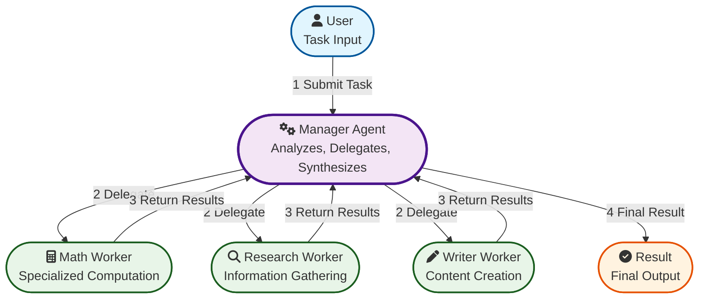
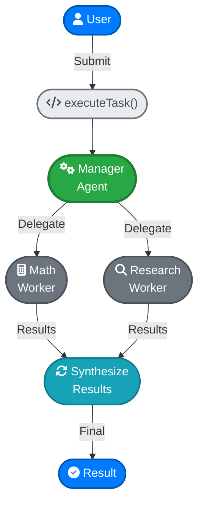

## How It Works



### 1. Task Submission
Users submit tasks to the **Manager Agent** through the `executeTask()` method.

### 2. Manager Analysis
The manager uses its LLM to analyze the task and determine which worker agents to call.

### 3. Worker Delegation
Workers are registered as "tools" in the manager's configuration. The manager calls workers like function tools.

### 4. Worker Execution
Each worker agent executes its specialized task using its own LLM provider and tools.

### 5. Result Synthesis
The manager combines worker results and provides the final response to the user.

## Core Components

### OfficeLLM Class

The main orchestrator that initializes and manages the manager and worker agents.

```typescript
const office = new OfficeLLM({
  manager: {
    name: 'Project Manager',
    provider: { type: 'anthropic', apiKey: '...', model: 'claude-3-sonnet' },
    systemPrompt: 'You coordinate AI workers...',
    tools: [
      {
        name: 'math_solver',
        description: 'Solve math problems',
        parameters: z.object({ task: z.string() }),
      },
    ],
  },
  workers: [
    {
      name: 'Math Solver',
      provider: { type: 'openai', apiKey: '...', model: 'gpt-4' },
      systemPrompt: 'You solve math problems...',
      tools: [/* worker's own tools */],
    },
  ],
});
```

### Manager Agent

**Role**: Task coordinator and delegator

- **Receives**: User tasks
- **Analyzes**: Task requirements using LLM
- **Delegates**: To appropriate worker agents
- **Synthesizes**: Final results

**Key Feature**: Workers are registered as "tools" that the manager can call.

### Worker Agent

**Role**: Specialized task execution

- **Receives**: Delegated tasks from manager
- **Executes**: Using domain-specific tools
- **Returns**: Results to manager

**Key Feature**: Each worker has its own LLM provider and tool set.

## Task Flow Example



## Provider Independence

Each agent can use different LLM providers independently:

```typescript
const office = new OfficeLLM({
  manager: {
    name: 'Manager',
    provider: { type: 'anthropic', model: 'claude-3-sonnet' }, // Anthropic
  },
  workers: [
    {
      name: 'Math',
      provider: { type: 'openai', model: 'gpt-4' }, // OpenAI
    },
    {
      name: 'Research',
      provider: { type: 'gemini', model: 'gemini-pro' }, // Google
    },
    {
      name: 'Writer',
      provider: { type: 'openrouter', model: 'anthropic/claude-3-haiku' }, // OpenRouter
    },
  ],
});
```

## Function Call Pattern

Workers are called like function tools:

```typescript
// Manager's perspective
tools: [
  {
    name: 'math_solver',        // Function name
    description: 'Solve math',  // Function description
    parameters: {               // Function parameters
      task: z.string(),
      priority: z.enum(['low', 'medium', 'high']),
    },
  },
]

// Manager calls worker
await manager.chat(messages, tools);
// Result: { toolCalls: [{ name: 'math_solver', arguments: '{"task":"..."}' }] }
```

## Type Safety

All interactions are type-safe using Zod schemas:

```typescript
// Tool parameters
const mathParams = z.object({
  expression: z.string().describe('Math expression'),
  precision: z.number().min(0).max(10).default(2),
});

// Task definitions
const task = z.object({
  title: z.string(),
  description: z.string(),
  priority: z.enum(['low', 'medium', 'high']).optional(),
});
```

## Error Handling

Built-in error handling for production use:

- **Provider failures**: Automatic retries with backoff
- **Network issues**: Graceful degradation
- **Invalid parameters**: Zod validation errors
- **Rate limits**: Respectful API usage

## Extensibility

Easy to extend with new capabilities:

- **New Providers**: Register with `ProviderFactory.register()`
- **New Tools**: Define with Zod schemas
- **Custom Workers**: Add specialized agents
- **Enhanced Managers**: Custom coordination logic

## Performance

Designed for efficient execution:

- **Concurrent tasks**: Multiple workers can run simultaneously
- **Provider optimization**: Choose appropriate models for tasks
- **Resource management**: Respect API limits and costs
- **Monitoring**: Track usage and performance metrics
