# officeLLM

A TypeScript library for building multi-agent AI systems with manager and worker agents that coordinate tasks using different LLM providers.

## What is officeLLM?

officeLLM provides a clean, extensible framework for creating intelligent multi-agent systems where:

- **Manager Agents** coordinate and delegate tasks to specialized workers
- **Worker Agents** execute specific tasks using their own tools and LLM providers
- **Extensible Provider System** supports OpenAI, Anthropic, Gemini, and OpenRouter
- **Type Safety** with Zod schemas for all tool parameters
- **FunctionDefinitions Format** compatible with AI package tool calling

## Key Features

<Cards>
  <Card
    title="Multi-Agent Architecture"
    icon="users"
    href="/core-concepts/architecture"
  >
    Managers orchestrate teams of specialized worker agents
  </Card>
  <Card
    title="Provider Agnostic"
    icon="globe"
    href="/core-concepts/providers"
  >
    Support for OpenAI, Anthropic, Gemini, and OpenRouter
  </Card>
  <Card
    title="Type Safe"
    icon="check"
    href="/core-concepts/architecture"
  >
    Zod schemas ensure type safety for all tool parameters
  </Card>
  <Card
    title="Extensible"
    icon="plus"
    href="/contributing/extending-providers"
  >
    Easy to add new providers and customize behavior
  </Card>
</Cards>

## Quick Example

```typescript
import { OfficeLLM } from 'officellm';
import { z } from 'zod';

// Define a worker agent
const mathWorker = {
  name: 'Math Solver',
  description: 'Specialized in mathematical calculations',
  provider: {
    type: 'openai' as const,
    apiKey: process.env.OPENAI_API_KEY!,
    model: 'gpt-4',
    temperature: 0.1,
  },
  systemPrompt: 'You are a mathematical expert. Solve problems step by step.',
  tools: [
    {
      name: 'calculate',
      description: 'Perform mathematical calculations',
      parameters: z.object({
        expression: z.string().describe('Math expression to evaluate'),
      }),
    },
  ],
};

// Manager configuration
const manager = {
  name: 'Project Manager',
  description: 'Coordinates AI worker agents',
  provider: {
    type: 'anthropic' as const,
    apiKey: process.env.ANTHROPIC_API_KEY!,
    model: 'claude-3-sonnet-20240229',
    temperature: 0.7,
  },
  systemPrompt: 'You coordinate specialized AI agents to complete tasks.',
  tools: [
    {
      name: 'math_solver',
      description: 'Delegate math tasks to the math expert',
      parameters: z.object({
        task: z.string().describe('Math task to solve'),
        priority: z.enum(['low', 'medium', 'high']).default('medium'),
      }),
    },
  ],
};

// Initialize and use
const office = new OfficeLLM({
  manager,
  workers: [mathWorker],
});

const result = await office.executeTask({
  title: 'Calculate compound interest',
  description: 'What is the compound interest on $1000 at 5% for 3 years?',
  priority: 'high',
});

console.log('Result:', result.content);
```

## Why officeLLM?

<Tip>
  **Simplified Architecture**: No complex parameter passing - just function calls between agents
</Tip>

<Info>
  **Type Safety**: Zod schemas ensure all tool parameters are properly validated
</Info>

<Warning>
  **Provider Agnostic**: Easy to switch between different LLM providers
</Warning>

<Check>
  **Extensible**: Adding new providers requires minimal code changes
</Check>

## Architecture Overview

```mermaid
flowchart TD
    %% Define styles
    classDef userNode fill:#007bff,color:#ffffff,stroke:#0056b3,stroke-width:2px
    classDef managerNode fill:#28a745,color:#ffffff,stroke:#1e7e34,stroke-width:3px
    classDef workerNode fill:#6c757d,color:#ffffff,stroke:#495057,stroke-width:2px

    %% Flow diagram
    A(["fa:fa-user User Task"]):::userNode
    A --> B(["fa:fa-cogs Manager Agent<br/>System Prompt<br/>Provider<br/>Worker Tools"])

    B --> C(["fa:fa-tools Worker Agent<br/>System Prompt<br/>Provider<br/>Tools"])
    B --> D(["fa:fa-tools Worker Agent<br/>System Prompt<br/>Provider<br/>Tools"])
    B --> E(["fa:fa-tools Worker Agent<br/>System Prompt<br/>Provider<br/>Tools"])

    %% Apply styles
    B:::managerNode
    C:::workerNode
    D:::workerNode
    E:::workerNode
```



The manager receives tasks and decides which worker agents to call, while each worker agent has its own specialized tools and LLM provider configuration.

## Next Steps

<CardGroup>
  <Card title="Quick Start" icon="zap" href="/quick-start">
    Get up and running in minutes
  </Card>
  <Card title="Installation" icon="download" href="/installation">
    Install officeLLM in your project
  </Card>
  <Card title="Core Concepts" icon="book" href="/core-concepts/architecture">
    Understand the architecture
  </Card>
</CardGroup>
